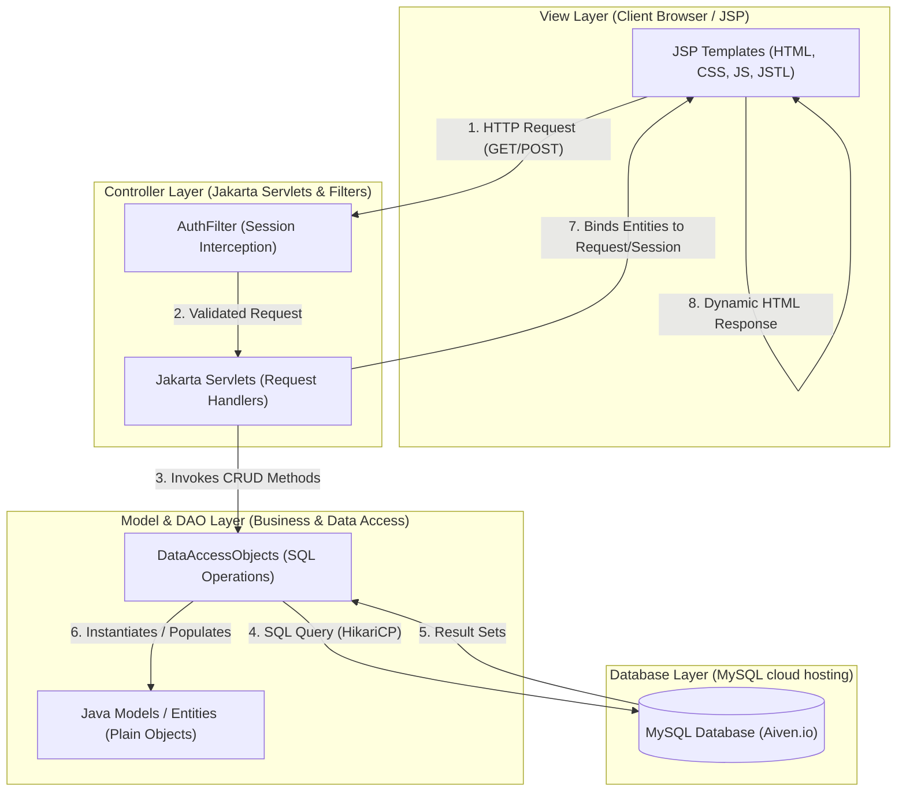
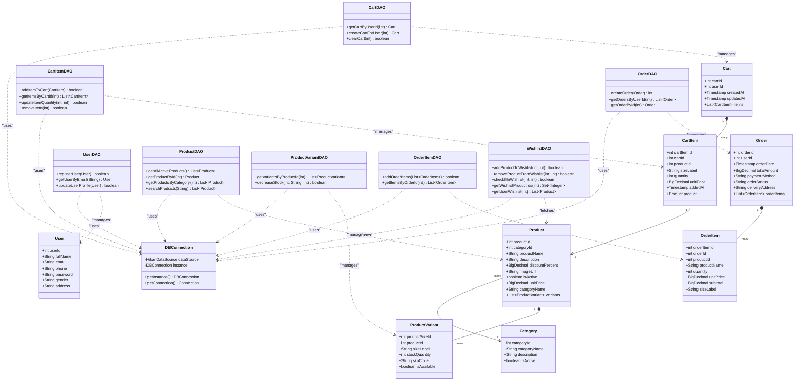
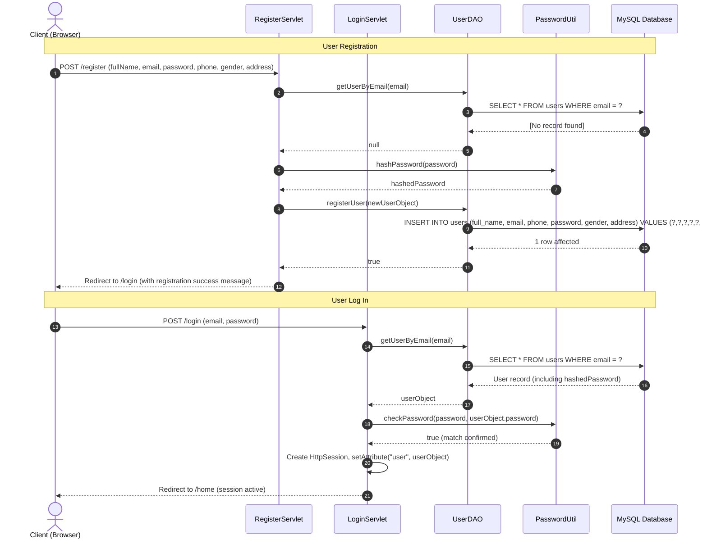
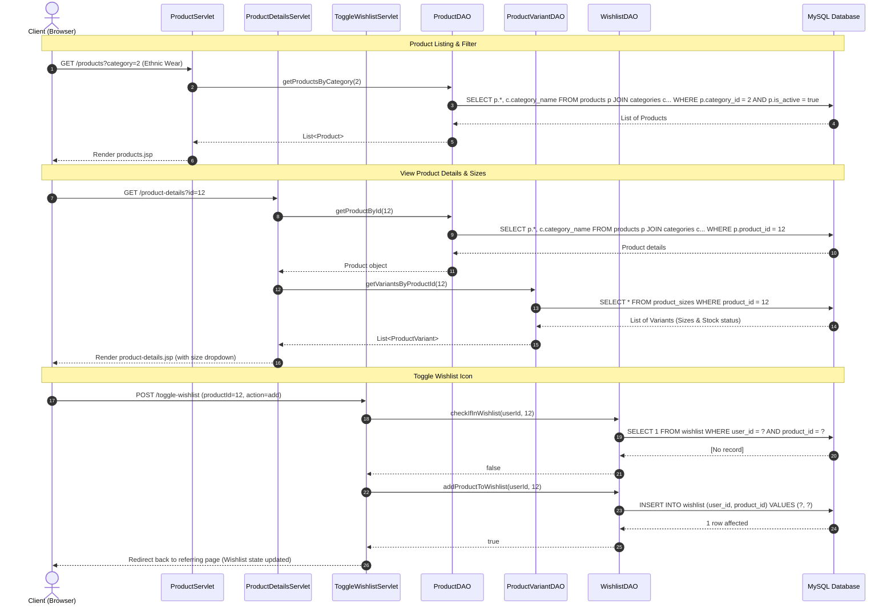
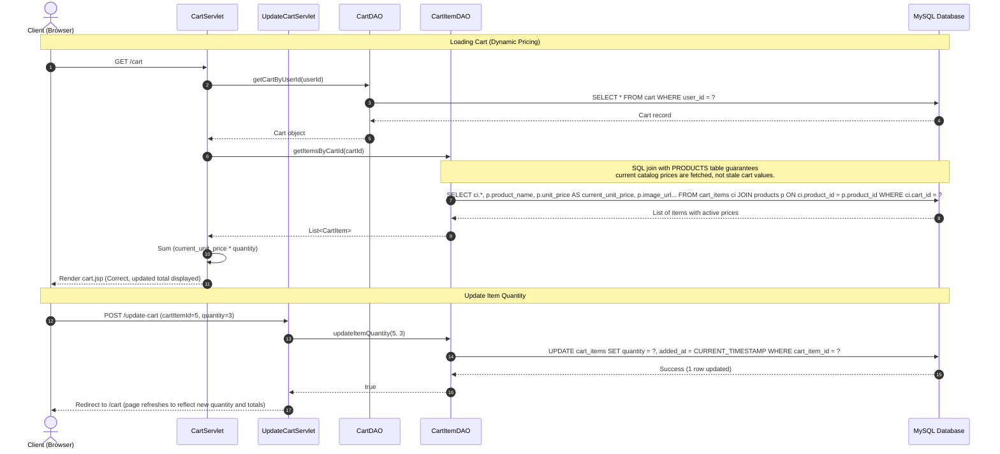
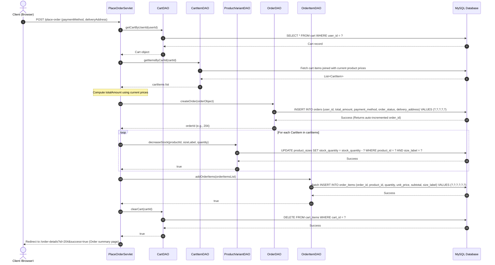
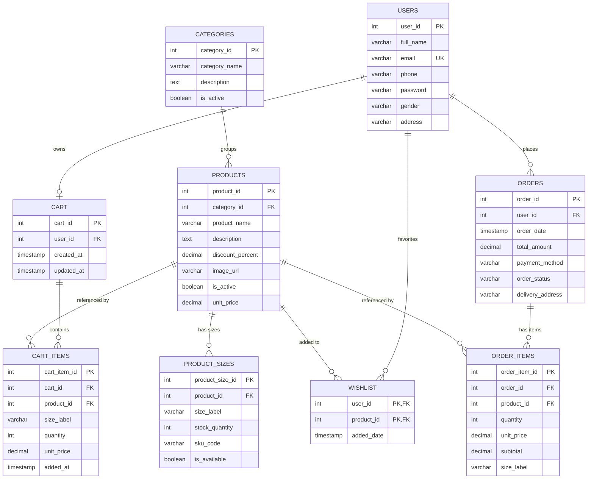

# 📐 FashionStore - System Architecture & Design Documentation

This documentation provides an architect-level overview of the `FashionStore` application. It includes system architecture flowcharts, database schemas, class relationships, sequence diagrams for key user journeys, and controller-to-data-access-object mappings.

---

## 1. MVC & System Architecture

The application adheres to the standard **Model-View-Controller (MVC)** architectural pattern. It decouples the presentation layer from the database operations and request handling.

### Components Breakdown:
*   **View Layer (`/src/main/webapp`)**: Serves user interfaces using JSP templates. Utilizes JSTL (`jakarta.tags`) for loop renderings, formatting, and structural checks. Style rules are managed in static CSS, and DOM interactions/validations in JavaScript.
*   **Controller Layer (`com.fashionstore.controller` & `com.fashionstore.filter`)**:
    *   `AuthFilter`: Intercepts protected URI patterns (e.g., checkout, profile, cart, order-details) to ensure a user is logged in, redirecting to `/login` if unauthenticated.
    *   `Servlets`: Coordinate requests, inspect HTTP headers and session states, instantiate/call DAOs, and direct page transitions using forwards or redirects.
*   **Model Layer (`com.fashionstore.model`)**: Simple Java beans (Plain Old Java Objects - POJOs) mapping directly to database table rows, containing only fields, getters, setters, and constructors.
*   **DAO Layer (`com.fashionstore.dao`)**: Encapsulates raw JDBC SQL statements. Interacts with the database connection pool (`DBConnection`) to query data, execute updates, and map relational database rows to Model objects.

---

## 2. Class Diagram

The following diagram illustrates the relationship between the Java Model entities, their corresponding Data Access Objects (DAOs), and database connection utilities.

---

## 3. End-to-End Sequence Diagrams

### Flow A: User Registration & Authentication
This sequence traces a user registering a new profile, hashing their password using Blowfish (`BCrypt`), and then logging in to create a server session.

---

### Flow B: Catalog Navigation & Wishlist Operations
This sequence explains how product searches are queried, variants are resolved, and items are toggled in and out of the wishlist database table.

---

### Flow C: Shopping Cart & Dynamic Pricing Validation
This flow details cart updates, specifically demonstrating how the catalog price is fetched dynamically from the `products` table on load to ensure that cart values are always up to date.

---

### Flow D: Checkout & Order Placement
This transaction handles checkout validation, inventory reduction (decrease stock per size variant), order writing, and cart clearing.

---

## 4. Database Design & Model Mapping

### Entity-Relationship (ER) Diagram
The database consists of 9 core tables. The relationships are shown in the ER diagram below:

### Relational Schema to Java Class Mapping

| Database Table | Column Name | Java Model Class | Property Name | Java Type | Description / Key Constraint |
|:---|:---|:---|:---|:---|:---|
| **`users`** | `user_id` | `User` | `userId` | `int` | Primary Key, Auto-increment |
| | `full_name` | | `fullName` | `String` | |
| | `email` | | `email` | `String` | Unique index, used for authentication |
| | `phone` | | `phone` | `String` | |
| | `password` | | `password` | `String` | BCrypt encrypted hash string |
| | `gender` | | `gender` | `String` | |
| | `address` | | `address` | `String` | Default delivery address |
| **`categories`** | `category_id` | `Category` | `categoryId` | `int` | Primary Key |
| | `category_name` | | `categoryName` | `String` | |
| | `description` | | `description` | `String` | |
| | `is_active` | | `isActive` | `boolean` | Status flag |
| **`products`** | `product_id` | `Product` | `productId` | `int` | Primary Key |
| | `category_id` | | `categoryId` | `int` | Foreign Key referencing `categories` |
| | `product_name` | | `productName` | `String` | |
| | `description` | | `description` | `String` | Product specifications |
| | `discount_percent`| | `discountPercent` | `BigDecimal` | Percentage discount |
| | `image_url` | | `imageUrl` | `String` | Path to image asset |
| | `is_active` | | `isActive` | `boolean` | Status flag |
| | `unit_price` | | `unitPrice` | `BigDecimal` | Current catalog unit price |
| **`product_sizes`** | `product_size_id` | `ProductVariant` | `productSizeId` | `int` | Primary Key |
| | `product_id` | | `productId` | `int` | Foreign Key referencing `products` |
| | `size_label` | | `sizeLabel` | `String` | Size code (e.g. S, M, L, XL, N/A) |
| | `stock_quantity` | | `stockQuantity` | `int` | Physical inventory count |
| | `sku_code` | | `skuCode` | `String` | Unique SKU identifier |
| | `is_available` | | `isAvailable` | `boolean` | Stock availability flag |
| **`cart`** | `cart_id` | `Cart` | `cartId` | `int` | Primary Key |
| | `user_id` | | `userId` | `int` | Foreign Key referencing `users` |
| | `created_at` | | `createdAt` | `Timestamp` | |
| | `updated_at` | | `updatedAt` | `Timestamp` | |
| **`cart_items`** | `cart_item_id` | `CartItem` | `cartItemId` | `int` | Primary Key |
| | `cart_id` | | `cartId` | `int` | Foreign Key referencing `cart` |
| | `product_id` | | `productId` | `int` | Foreign Key referencing `products` |
| | `size_label` | | `sizeLabel` | `String` | Mapped selected size |
| | `quantity` | | `quantity` | `int` | |
| | `unit_price` | | `unitPrice` | `BigDecimal` | Historical price at addition |
| | `added_at` | | `addedAt` | `Timestamp` | Timestamp of update |
| **`orders`** | `order_id` | `Order` | `orderId` | `int` | Primary Key |
| | `user_id` | | `userId` | `int` | Foreign Key referencing `users` |
| | `order_date` | | `orderDate` | `Timestamp` | Order placement timestamp |
| | `total_amount` | | `totalAmount` | `BigDecimal` | Sum total of the order items |
| | `payment_method` | | `paymentMethod` | `String` | COD, Card, or UPI |
| | `order_status` | | `orderStatus` | `String` | Pending, Shipped, Delivered |
| | `delivery_address`| | `deliveryAddress` | `String` | Explicit delivery address |
| **`order_items`** | `order_item_id` | `OrderItem` | `orderItemId` | `int` | Primary Key |
| | `order_id` | | `orderId` | `int` | Foreign Key referencing `orders` |
| | `product_id` | | `productId` | `int` | Foreign Key referencing `products` |
| | `quantity` | | `quantity` | `int` | |
| | `unit_price` | | `unitPrice` | `BigDecimal` | Purchase unit price |
| | `subtotal` | | `subtotal` | `BigDecimal` | `quantity` * `unit_price` |
| | `size_label` | | `sizeLabel` | `String` | Mapped size descriptor |

---

## 5. Controller-to-DAO Mappings

This matrix maps each of the **17 HTTP Servlets** to the **DAO layers** they instantiate, execute, and retrieve data from.

| Controller / Servlet Name | URL Pattern | Associated DAO(s) | Primary Purpose / Operations |
|:---|:---|:---|:---|
| **`AddToCartServlet`** | `/add-to-cart` | `CartDAO`, `CartItemDAO` | Resolves cart record for user; adds item or updates quantity if duplicate |
| **`CartServlet`** | `/cart` | `CartDAO`, `CartItemDAO` | Retrieves cart and nested cart items (loads dynamic product price) for rendering |
| **`CheckoutServlet`** | `/checkout` | `CartDAO`, `CartItemDAO` | Loads delivery address details and final cart values to prepare order |
| **`HomeServlet`** | `/home` | `CategoryDAO`, `ProductDAO` | Loads core home page slider, category options, and popular collections |
| **`LoginServlet`** | `/login` | `UserDAO`, `WishlistDAO` | Verifies user credentials, hashes checks, and fetches initial user wishlist set |
| **`LogoutServlet`** | `/logout` | *None* | Invalidates the active HttpSession and logs user out |
| **`OrderDetailsServlet`**| `/order-details`| `OrderDAO`, `OrderItemDAO` | Fetches details of a specific order transaction, listing purchase items |
| **`OrdersServlet`** | `/my-orders` | `OrderDAO` | Lists all historical orders placed by the current user |
| **`PlaceOrderServlet`** | `/place-order` | `CartDAO`, `CartItemDAO`, `OrderDAO`, `OrderItemDAO`, `ProductVariantDAO` | Oversees order transaction processing: inserts orders, decrements size stock, writes order items, and flushes cart |
| **`ProductDetailsServlet`**| `/product-details`| `ProductDAO`, `ProductVariantDAO` | Loads main details and all related stock size variations for a product |
| **`ProductServlet`** | `/products` | `ProductDAO`, `CategoryDAO` | Lists products with active category filtering or textual search queries |
| **`ProfileServlet`** | `/profile` | `UserDAO` | Retrieves and updates user attributes (phone, address, full name) |
| **`RegisterServlet`** | `/register` | `UserDAO` | Validates email uniqueness, salts/hashes password, and writes user row |
| **`RemoveCartItemServlet`**| `/remove-cart-item`| `CartItemDAO` | Removes a specific item record from the database cart mapping |
| **`ToggleWishlistServlet`**| `/toggle-wishlist`| `WishlistDAO` | Adds or removes a user-product record link from the wishlist table |
| **`UpdateCartServlet`** | `/update-cart` | `CartItemDAO` | Modifies the quantity of a cart item or removes it if quantity is zero |
| **`WishlistServlet`** | `/wishlist` | `WishlistDAO` | Retrieves all product items favorited by the user for rendering |
